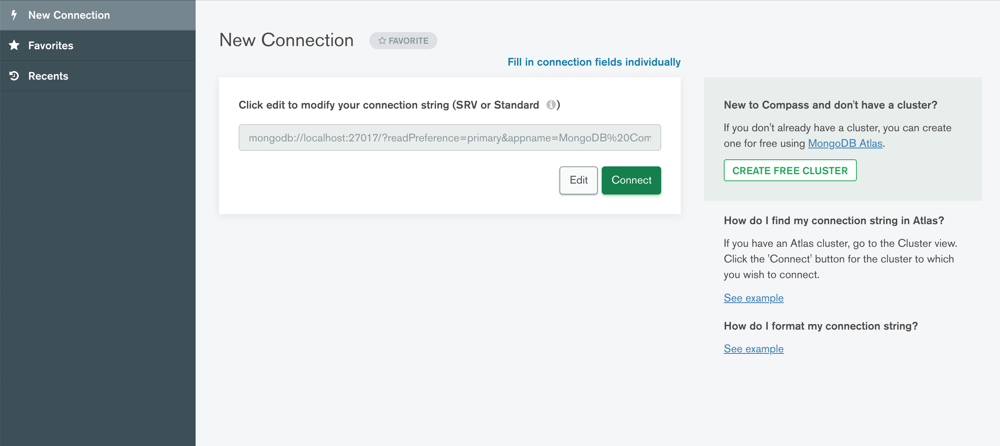
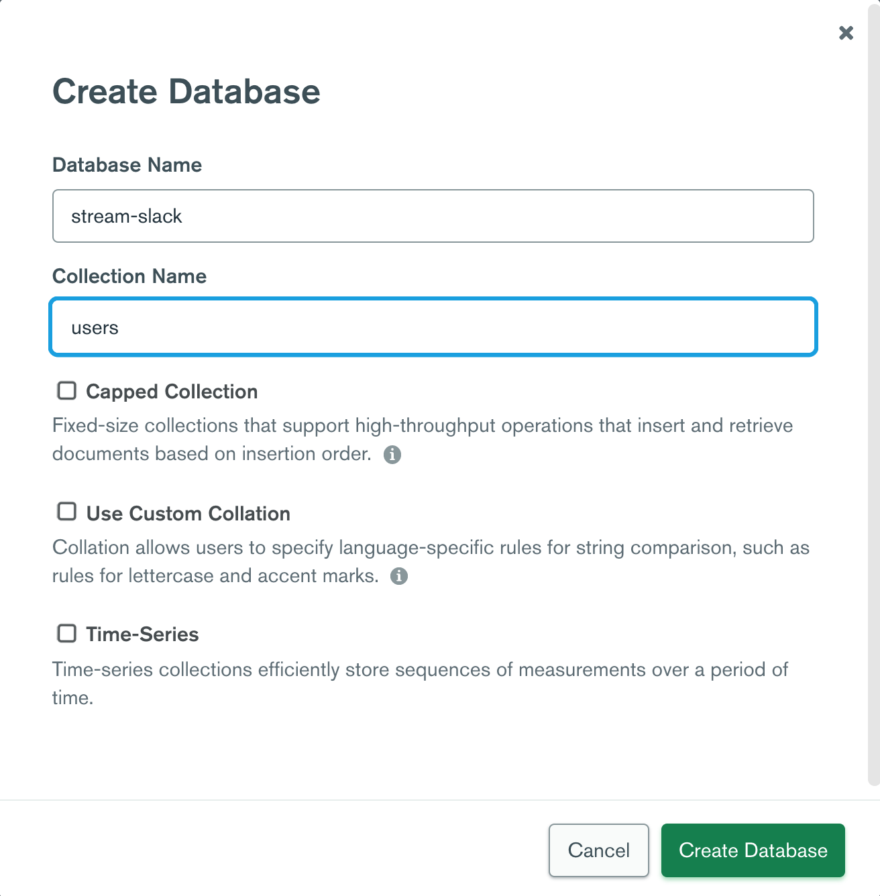

# Slack Demo Server

This is the backend server for [Slack demo](https://github.com/dillionmegida/slack-demo), a slack-like demo app which shows how to use the [the Stream React SDK](https://getstream.io/chat/docs/sdk/react/) to build a team messaging application.

## Table of Contents

- [Setting up locally](#setting-up-locally)
  - [Requirements](#requirements)
  - [Clone the project](#clone-the-project)
  - [Install Dependencies](#install-dependencies)
  - [Setup MongoDB](#setup-mongodb)
  - [Provide environment variables](#provide-environment-variables)
  - [Run the server](#run-the-server)
- [Deployment](#deployment)
- [Author](#author)

When you're done with this readme, be sure to check that of the slack-demo to get the app working as expected.

## Setting up locally

This project manages two things for the demo:

- authentication (and saving users to the database)
- generating Stream token for connecting users to Stream

You can use any database you want, but this project uses [MongoDB](https://www.mongodb.com/).

### Requirements

- [Node.js](https://nodejs.org/en/) installed on your machine.
- [MongoDB (Community Version)](https://docs.mongodb.com/manual/administration/install-community/) installed on your machine.
- [MongoDB Compass](https://www.mongodb.com/try/download/compass) installed on your machine. This provides a GUI for MongoDB.
- [Stream Account](https://getstream.io/try-for-free/)

### Clone the project

```bash
git clone git@github.com:dillionmegida/slack-demo-server.git
```

### Install Dependencies

```shell
cd slack-demo-server
npm install
```

### Setup MongoDB

After installing MongoDB and Compass, open the Compass application. Interacting with the MongoDB database via the terminal can be difficult. With Compass, it becomes easier.

When you open Compass, you see this:



`mongodb://localhost:27017` is the localhost for mongodb. Click on "Connect" and create a database:



In the create modal, add "stream-chat" (or whatever name of your choice) for the database name and also add a "users" collection.

This makes up your `MONGODB_URI` which will be `mongodb://localhost:27017/stream-slack` (used below).

### Provide environment variables

As seen in the [.env.example file](./env.example), you need to provide the following environment variables in a `.env` file:

```shell
PORT = <a port of your choice...5000 is used for this project>
MONGODB_URI = <mongo uri for your database>
JWT_SECRET_KEY = <any string>
STREAM_API_KEY = <your stream API key>
STREAM_SECRET_KEY = <your stream secret key key>
```

`JWT_SECRET_KEY` can be any string of your choice. It is used to create and verify tokens during authentication.

You would need to get your stream API and secret key from your dashboard.

### Run the server

```bash
npm run dev
```

Now, your server would be running on `localhost:5000`, and your frontend can now make requests to your server.

## Deployment

Deploying this backend to a server is a bit more complicated. And the reason for this is, you need a database. Since hosting providers may not allow you to install MongoDB on their servers, you may want to check out [MongoDb Atlas](https://www.mongodb.com/cloud/atlas/lp/try2)

## Author

[Dillion Megida](https://dillionmegida.com)
